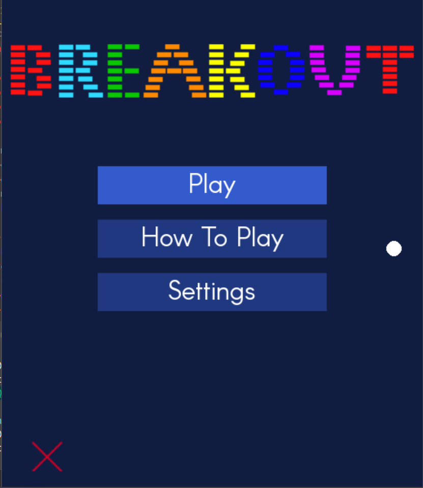
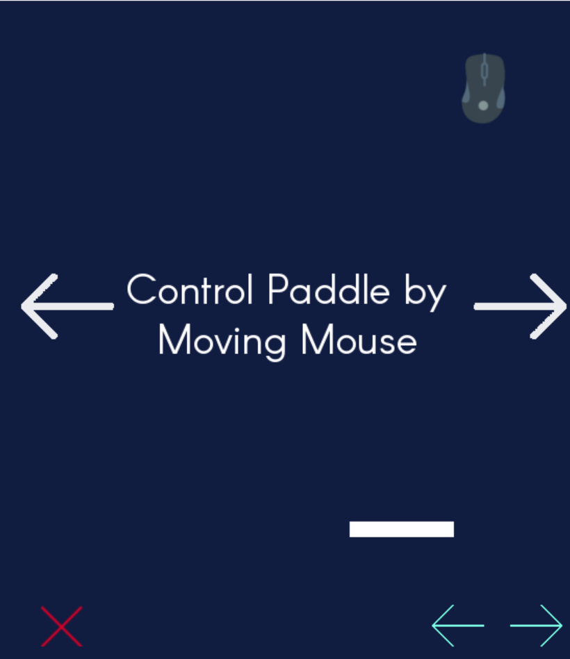
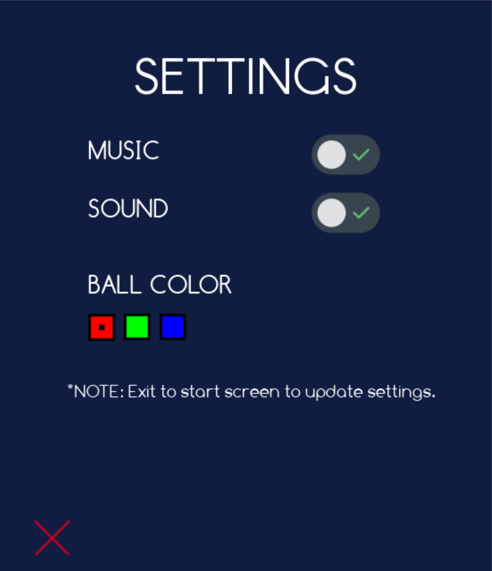
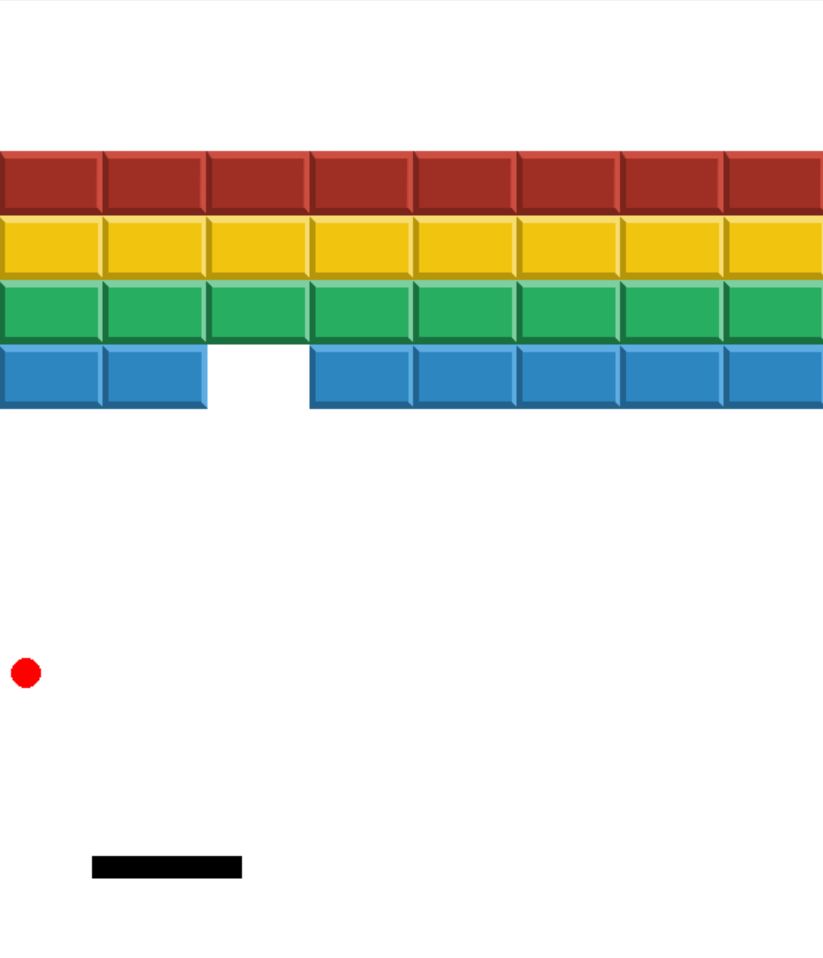

# Atari Breakout

## About

This game is based on the classic Atari Breakout, and the rules
are similar. On each level, there are a certain number of bricks
positioned about the screen and the player, has to destroy all of
them to move on to the next stage. This is done by bouncing a ball
about the screen with a paddle, which you, the player, controls.

Made in 2016.

## Gameplay Images

Homepage

How to Play

Settings

Gameplay

